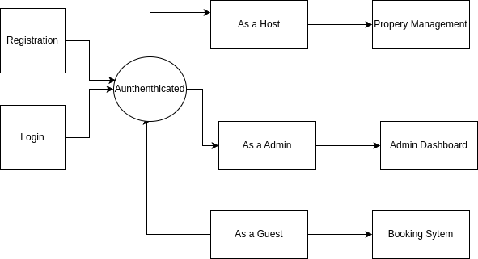
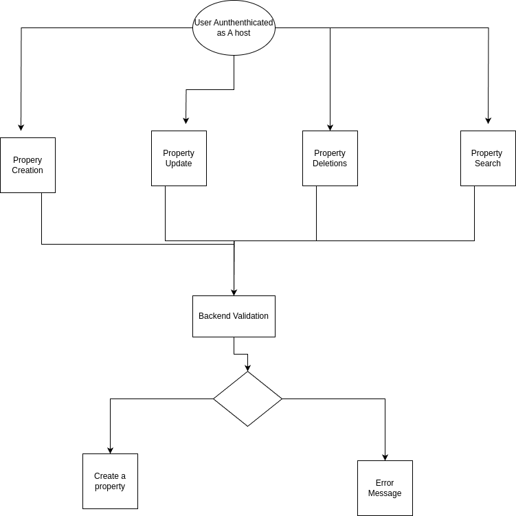

### **Airbnb Clone Backend Requirements**

---

## **🎯 Objective**

This project aims to design and implement the backend system for an Airbnb Clone. The backend will support core functionalities such as user management, property listings, booking, payments, and reviews, ensuring scalability, security, and robustness. This README provides a comprehensive breakdown of the project requirements, including placeholders for diagrams to visualize the architecture and workflows.

---

## **📚 Overview**

The Airbnb Clone backend will provide server-side logic, database management, and API integrations for a seamless rental marketplace experience. The system must prioritize performance, scalability, and user-friendliness.

---

## **📑 Key Components**

### 1. **Core Functionalities**
The backend will implement the following essential features:

#### **1.1 User Management**
- **Registration**: Allow users to register as **Guests** or **Hosts**.
- **Authentication**: 
  - Secure login via email/password.
  - OAuth support (Google, Facebook).
- **Profile Management**: Users can update profile photos, contact details, and preferences.

---

#### **1.2 Property Listings Management**
- **Add Listings**: Hosts can add property details (title, description, location, price, amenities).
- **Edit/Delete Listings**: Hosts can update or remove properties.

#### **1.3 Search and Filtering**
- Implement a search functionality allowing users to filter properties by:
  - Location
  - Price Range
  - Number of Guests
  - Amenities (e.g., Wi-Fi, pool, pet-friendly)
- Include pagination for large datasets.

#### **1.4 Booking Management**
- **Create Booking**: Prevent double bookings using date validation.
- **Cancel Booking**: Allow guests and hosts to cancel based on policies.
- **Booking Status**: Track statuses such as pending, confirmed, canceled, or completed.

---

#### **1.5 Payment Integration**
- **Payment Gateways**: Use secure systems like **Stripe** or **PayPal** for:
  - Guest payments.
  - Host payouts.
- Support for multiple currencies.

---

#### **1.6 Reviews and Ratings**
- Guests can rate and review properties.
- Hosts can respond to reviews.
- Notifications for reviews and responses.

---

### 2. **Technical Requirements**

#### **2.1 Database Management**
- **Relational Database**: Use PostgreSQL or MySQL with these tables:
  - `Users`
  - `Properties`
  - `Bookings`
  - `Reviews`
  - `Payments`
- **Data Relationships**:
  - Link `Reviews` to `Bookings` to avoid review misuse.

---

#### **2.2 API Development**
- **RESTful API** with:
  - HTTP methods: GET, POST, PUT/PATCH, DELETE.
  - Proper status codes.
- **Optional**: Use GraphQL for complex queries.

---

#### **2.3 Authentication and Authorization**
- Use JWT for secure sessions.
- Implement Role-Based Access Control (RBAC):
  - Guests
  - Hosts
  - Admins

---
